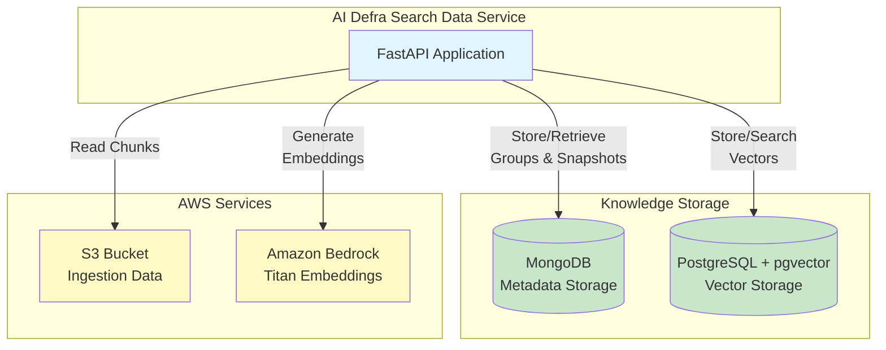
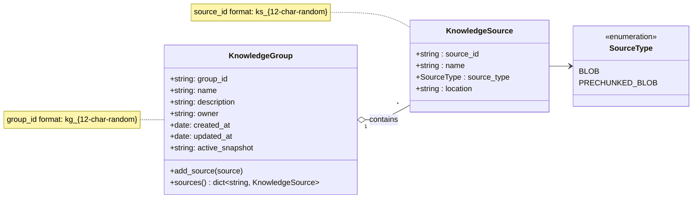
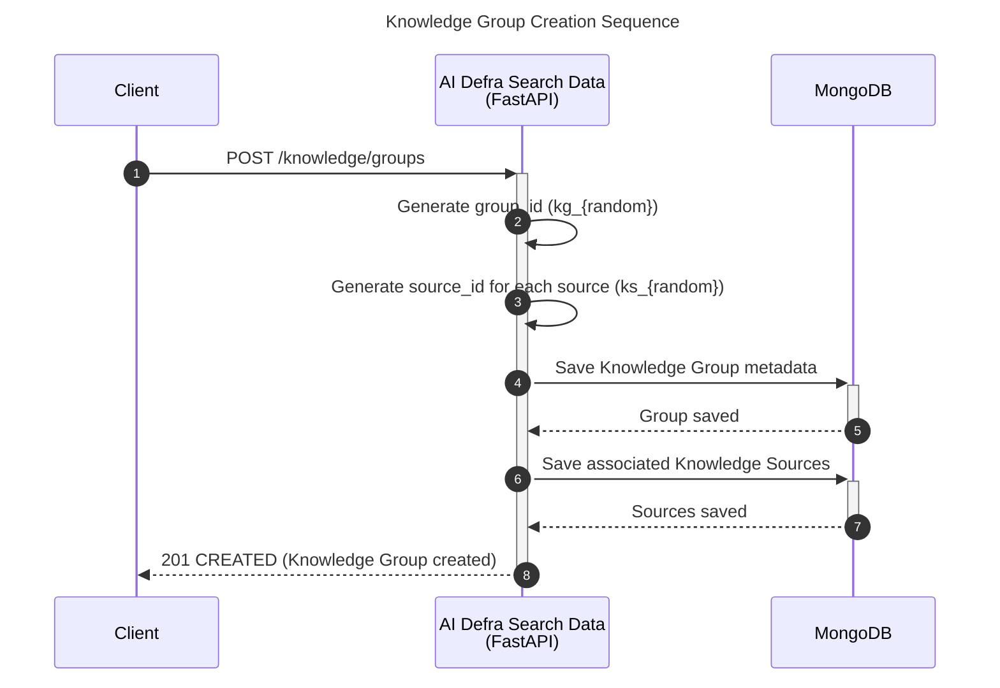
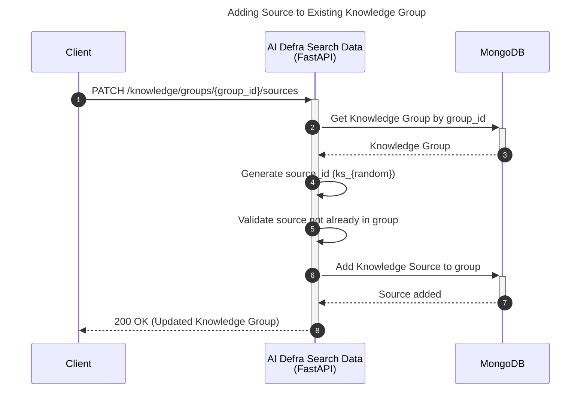
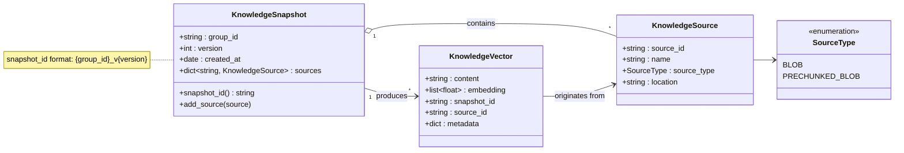
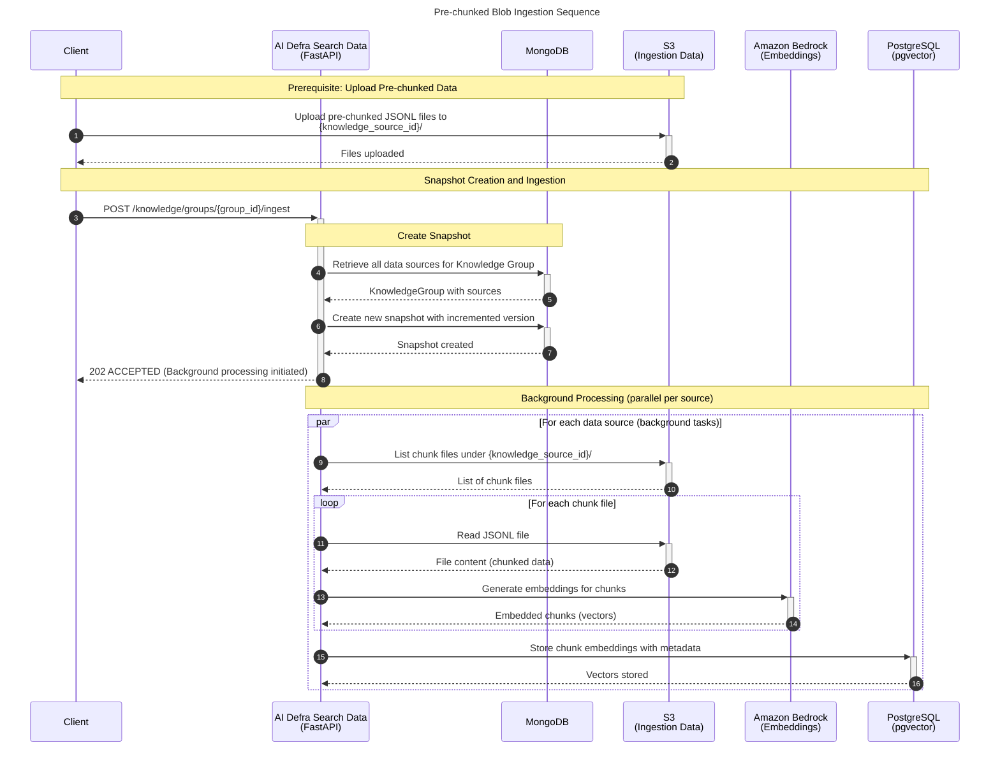
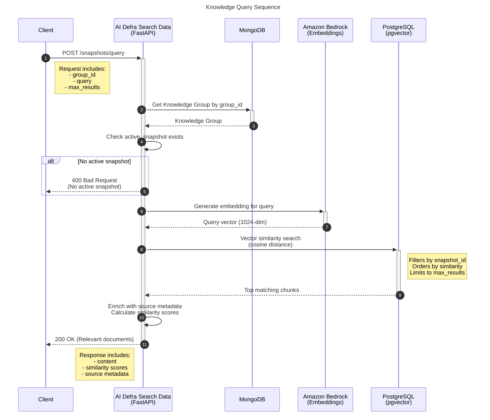

# ai-defra-search-data

A agentic workflow that demonstrates client-side Model Context Protocol (MCP) usage within a FastAPI application.

## Prequisites
- [Python](https://docs.python.org/3/using/index.html) `>= 3.12` - We recommend using [uv](https://docs.astral.sh/uv/getting-started/installation/) to manage your Python environment.
- [pipx](https://pipxproject.github.io/pipx/installation/)
- [uv](https://docs.astral.sh/uv/getting-started/installation/) 
- [Docker and Docker Compose](https://docs.docker.com/get-docker/) - Optional if using startup script.
- [MCP Inspector](https://github.com/modelcontextprotocol/inspector) - Optional, but recommended for developing against MCP server.

## Requirements

### Python

Please install python `>= 3.12` and `pipx` in your environment. This template uses [uv](https://github.com/astral-sh/uv) to manage the environment and dependencies.

```python
# install uv via pipx
pipx install uv

# sync dependencies
uv sync
```

This opinionated template uses the [`Fast API`](https://fastapi.tiangolo.com/) Python API framework.

### Environment Variable Configuration

The application uses Pydantic's `BaseSettings` for configuration management in `app/config.py`, automatically mapping environment variables to configuration fields.

In CDP, environment variables and secrets need to be set using CDP conventions.  See links below:
- [CDP App Config](https://github.com/DEFRA/cdp-documentation/blob/main/how-to/config.md)
- [CDP Secrets](https://github.com/DEFRA/cdp-documentation/blob/main/how-to/secrets.md)

For local development - see [instructions below](#local-development).

### Linting and Formatting

This project uses [Ruff](https://github.com/astral-sh/ruff) for linting and formatting Python code.

#### Running Ruff

To run Ruff from the command line:

```bash
# Run linting with auto-fix
uv run ruff check . --fix

# Run formatting
uv run ruff format .
```

## Local development

### Setup & Configuration

Follow the convention below for environment variables and secrets in local development.

**Note** that it does not use `.env` or `python-dotenv` as this is not the convention in the CDP environment.

**Environment variables:** `compose/aws.env`.

**Secrets:** `compose/secrets.env`. You need to create this, as it's excluded from version control.

**Libraries:** Ensure the python virtual environment is configured and libraries are installed using `uv sync`, [as above](#python)

**Pre-Commit Hooks:** Ensure you install the pre-commit hooks, as above

### Development

This app can be run locally by either using the Docker Compose project or via the provided script `scripts/start_dev_server.sh`.

#### Using Docker Compose

To run the application using Docker Compose, you can use the following command:

```bash
docker compose --profile service up --build
```

If you want to enable hot-reloading, you can press the `w` key once the compose project is running to enable `watch` mode.

#### Using the provided script

To run the application using the provided script, you can execute:

```bash
./scripts/start_dev_server.sh
```

This script will:

- Check if Docker is running
- Start dependent services with Docker Compose (Localstack, MongoDB)
- Set up environment variables for local development
- Load configuration from compose/aws.env and compose/secrets.env
- Verify the Python virtual environment is set up
- Start the FastAPI application with hot-reload enabled

The service will then run on `http://localhost:8085`

### Testing

Ensure the python virtual environment is configured and libraries are installed using `uv sync`, [as above](#python)

Testing follows the [FastApi documented approach](https://fastapi.tiangolo.com/tutorial/testing/); using pytest & starlette.

To test the application run:

```bash
uv run pytest
```

## Architecture Overview

The service consists of a FastAPI application that interacts with AWS services and databases to store and retrieve knowledge data.

By default, all metadata / models are stored in MongoDB, with Postgres (using the pgvector extension) being used exclusively for vector storage and similarity search.



The service is built around two main domain concepts:
* Knowledge Groups - A collection of related data sources that can be ingested and queried together.
* Knowledge Snapshots - An immutable snapshot of ingested data from a Knowledge Group at a specific point in time.

### API Documentation

Automated API documentation via FastAPI and Swagger UI is available at:

```
http://localhost:8085/docs
```

### Knowledge Group

A Knowledge Group represents a collection of related data sources that can be ingested and queried together. Each Knowledge Group has a unique identifier and contains metadata about the data sources it encompasses.

#### Domain Model



**Identifier Format:**
- `group_id`: Auto-generated in the format `kg_{random}` where `{random}` is a 12-character  string (lowercase letters and digits)
- `source_id`: Auto-generated in the format `ks_{random}` where `{random}` is a 12-character  string (lowercase letters and digits)

#### Creation Process



#### Adding Sources



### Knowledge Snapshots

A Knowledge Snapshot represents an immutable snapshot of a Knowledge Group at a specific point in time. On the triggering of a snapshot creation, all data sources within the associated Knowledge Group are ingested and stored as part of the snapshot.

This allows for versioned access to the ingested data, enabling users to query historical data states and for auditability of what context was available at any given time. In the future, this could also allow for automated regression testing via frameworks such as [Ragasti](https://docs.ragas.io/en/stable/) and faciliate rollbacks to previous data states if needed.

#### Domain Model



**Identifier Format:**
- `snapshot_id`: Computed property in the format `{group_id}_v{version}` (e.g., `kg_abc123def456_v1`)

#### Pre-chunked Blob Ingestion Process

Currently, only pre-chunked blobs within the `ai-defra-search-ingestion-data` S3 bucket are supported for ingestion. The name of this bucket will change based on the CDP environment and can be configured via the `INGESTION_DATA_BUCKET_NAME` environment variable.

The S3 bucket is structured as follows:
```
    - {knowledge_source_id}/
        - chunks_1.txt
        - chunks_2.txt
        - ...
```

Chunk files are expected to be JSONL files, with each line representing a chunk of data to be ingested according to the following schema:
```json
{
    "source": "string",  // Original source location e.g. URL or file path
    "text": "string"     // Chunked text content
}
```



#### Query Process

Active snapshots can be queried using semantic search. The active snapshot for a Knowledge Group is specified by the `active_snapshot` field in the Knowledge Group metadata.



## Custom Cloudwatch Metrics

Uses the [aws embedded metrics library](https://github.com/awslabs/aws-embedded-metrics-python). An example can be found in `metrics.py`

In order to make this library work in the environments, the environment variable `AWS_EMF_ENVIRONMENT=local` is set in the app config. This tells the library to use the local cloudwatch agent that has been configured in CDP, and uses the environment variables set up in CDP `AWS_EMF_AGENT_ENDPOINT`, `AWS_EMF_LOG_GROUP_NAME`, `AWS_EMF_LOG_STREAM_NAME`, `AWS_EMF_NAMESPACE`, `AWS_EMF_SERVICE_NAME`

## Licence

THIS INFORMATION IS LICENSED UNDER THE CONDITIONS OF THE OPEN GOVERNMENT LICENCE found at:

<http://www.nationalarchives.gov.uk/doc/open-government-licence/version/3>

The following attribution statement MUST be cited in your products and applications when using this information.

> Contains public sector information licensed under the Open Government license v3

### About the licence

The Open Government Licence (OGL) was developed by the Controller of Her Majesty's Stationery Office (HMSO) to enable
information providers in the public sector to license the use and re-use of their information under a common open
licence.

It is designed to encourage use and re-use of information freely and flexibly, with only a few conditions.
